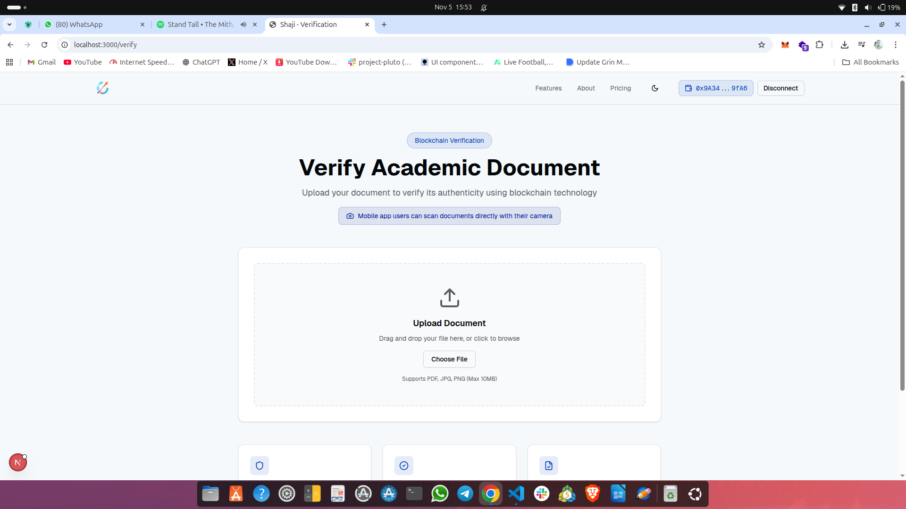

#  My shaji Web Project

This project is a full-stack web application built with **Next.js**, **PostgreSQL**, **Aqua SDK ** and **TypeScript** ** js ** 
It demonstrates database-driven features, API routing, and modern UI components optimized for performance and scalability.


## ⚙️ Setup & Installation

1. Clone the repository:
   ```bash
   git clone https://github.com/Allo-lala/Shaji-website-on-Aqua
   cd Shaji-website-on-Aqua
## You should see something like this 
   
## Connect your wallet
   

## Then you can choose a file 
  
## Upload 
  

## Congrats 
  

## Ooops 
    