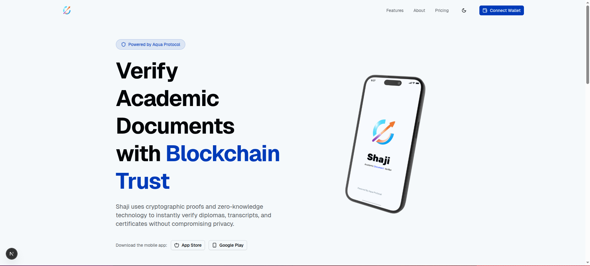
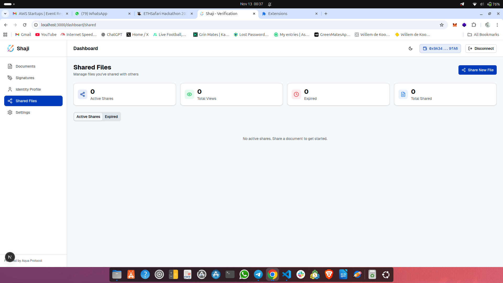
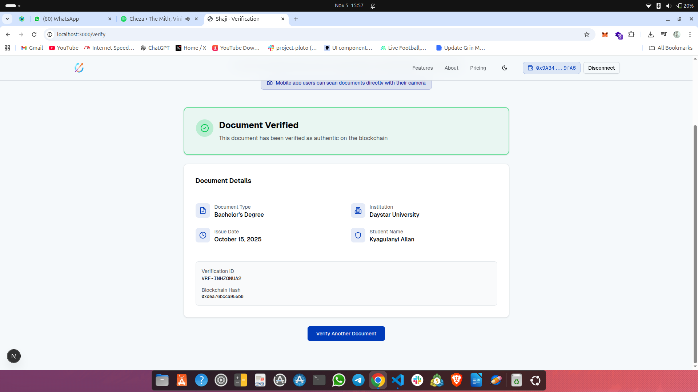

## 🌍 Shaji 

Shaji comes from the Kiswahili word “Uthibitishaji” meaning verification — a name that captures the app’s purpose perfectly.
It is an Aqua -powered verification platform that allows users to authenticate academic documents with trust, transparency and ease.

The web app allows users to connect their crypto wallet, access a personalized dashboard, upload documents, and verify their authenticity.
The mobile app brings the same experience on the go — intuitive, lightweight, and optimized for real users.

## 🚀 About the Project

This project is a full-stack web and mobile solution built with:
**Aqua SDK** 
**Next.js** 
**React Native** for the mobile app
**PostgreSQL** 
**TypeScript** 

## 🖥️ Quick Preview
   

## Connect Your Wallet
   

## Upload 
  
## Dashboard Overview
  

## Congrats 
  

## Ooops 
    

## 👥 Team

| Name                 | Role                                | GitHub                                     |
| -------------------- | ----------------------------------- | ------------------------------------------ |
| **Kyagulanyi Allan** | Full Stack Developer                | [@Allo-lala](https://github.com/Allo-lala) |
| **WiberForce**       | UI/UX & Frontend Developer          | [@Wilberforcedev](https://github.com/Wilberforcedev)     |
| **Odhiambo M**       | Backend & Smart Contract Developer  | [@mickieodhiambo](https://github.com/mickieodhiambo) |

## ⚙️ Setup & Installation
`Clone the repository or download a Zipped File`
`cd Shaji-WebApp`
`Install dependencies`
`npm install`
`npm run dev`     